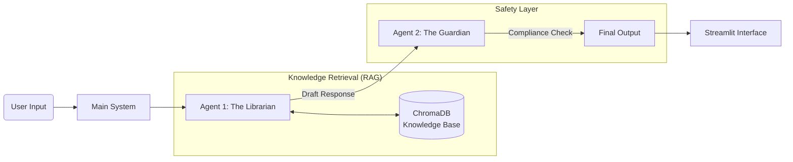

# 🧢 Cappy: The Savvy Capybara (UK Financial Assistant)

   

> **"Lowering your blood pressure while raising your Financial IQ."**

Cappy is an autonomous AI agent designed to help UK school leavers and young adults navigate the confusing world of personal finance. From understanding **ISAs** to avoiding **Overdraft** traps, Cappy provides safe, jargon-free education using a multi-agent architecture.

### 🔗 [Click Here to Try the Live App](https://capstone-fin-assist.streamlit.app/)

---

## 📋 Table of Contents
- [The Problem](#-the-problem)
- [The Solution](#-the-solution)
- [System Architecture](#-system-architecture)
- [Agent Workflow](#-agent-workflow)
- [Tech Stack](#-tech-stack)
- [Evaluation & Quality](#-evaluation--quality)
- [Installation](#-installation--setup)
- [Video Demo](#-video-demo)

---

## 🚩 The Problem
Financial literacy in the UK is critically low among young adults leaving full-time education.
* **The Knowledge Gap:** Concepts like "Compound Interest," "ISAs," and "Direct Debits" are rarely taught in schools.
* **The "Free Money" Trap:** Students often view overdrafts as free cash rather than debt, leading to long-term credit score damage.
* **The Jargon Barrier:** Traditional banking advice is often dry, overly formal, and intimidating.

## 💡 The Solution
**Cappy** is not just a chatbot; it is a **RAG-augmented Multi-Agent System** that acts as a financial concierge.
1.  **It knows the facts:** It retrieves accurate UK-specific financial data from a curated knowledge base.
2.  **It keeps it chill:** It translates "Bank Speak" into plain English using the "Savvy Capybara" persona.
3.  **It keeps it safe:** A secondary "Guardian" agent reviews every response to ensure compliance and prevent irresponsible financial advice.

---

## 🏗️ System Architecture

Cappy utilizes a **Sequential Chain Pattern** (Librarian -> Guardian) to ensure accuracy and safety.



### 🤖 Agent Workflow

1.  **Retrieval (The Tool):** The system queries **ChromaDB** to fetch context-specific guides (e.g., `isa_guide.txt`) relevant to the user's question.
2.  **Agent 1: The Librarian (Generator):**
    * **Model:** Gemini 2.5 Flash.
    * **Role:** Synthesizes the retrieved data into the "Savvy Capybara" persona.
    * **Goal:** Educational, jargon-free, and encouraging.
3.  **Agent 2: The Guardian (Critique):**
    * **Model:** Gemini 2.5 Flash.
    * **Role:** Acts as a Financial Compliance Officer.
    * **Goal:** Reviews Agent 1's draft to remove direct financial advice (e.g., changing "You should buy..." to "Some people use..."), ensures UK-specific terminology, and verifies safety.

---

## 🛠️ Tech Stack

* **LLM:** Google Gemini 2.5 Flash (via `google-generativeai`)
* **Vector Database:** ChromaDB (Persistent local storage)
* **Interface:** Streamlit
* **Language:** Python 3.11
* **Deployment:** Streamlit Cloud (Compatible with `pysqlite3-binary`)

---

## 📊 Evaluation & Quality

To ensure Cappy gives safe and helpful advice, we prioritize **Evaluation** as a core architectural pillar.

### 1. The Golden Dataset (`eval_questions.csv`)
We maintain a curated dataset of questions covering high-risk topics (Overdrafts, Debt) and factual topics (ISAs). This ensures we can regress-test the agent against known good answers.

### 2. The "Guardian" Protocol (Safety)
We strictly adhere to the "Agents for Good" track requirements by implementing a specific **Guardrails Layer**. The Guardian Agent enforces:
* **No Direct Advice:** Shifts language from directive ("Do this") to descriptive ("This is how it works").
* **Geographic Constraint:** Ensures advice is relevant to UK HMRC/FCA rules, not US laws.

---

## 🚀 Installation & Setup

### 1. Clone the Repository
```bash
git clone [https://github.com/your-username/cappy-agent.git](https://github.com/your-username/cappy-agent.git)
cd cappy-agent
```

### 2. Install Dependencies
```bash
pip install -r requirements.txt
```

### 3. API Key Configuration
Create a `.streamlit/secrets.toml` file:
```toml
[secrets]
GOOGLE_API_KEY = "your_gemini_api_key_here"
```

### 4. Build the Knowledge Base
*Note: The app auto-builds the database on the first run, but you can force a rebuild using:*
```bash
python create_database.py
```

### 5. Run the Agent
```bash
streamlit run app.py
```

---

## 🎥 Video Demo

*(Link to YouTube video coming soon)*

**Video Highlights:**
* **0:00** - The Problem: Financial illiteracy in the UK.
* **0:45** - The Solution: Meeting Cappy.
* **1:30** - Under the Hood: RAG + Multi-Agent Architecture.
* **2:15** - Live Demo: Asking about "Free Money" (Overdrafts) and seeing the safety guardrails in action.

---

**Disclaimer:** *Cappy is an educational tool designed to improve financial literacy. It does not constitute regulated financial advice. Always consult a qualified professional before making significant financial decisions.*